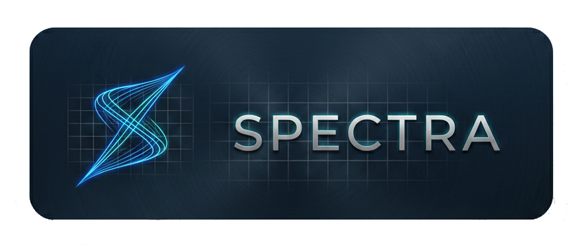

<p align="center">
  <p align="center">
    
  </p>
  <p align="center">
    <strong>GPU-accelerated scientific plotting for C++20 and Python</strong>
  </p>
  <p align="center">
    2D &amp; 3D visualization · Real-time animation · Multi-window · Python IPC · Headless export
  </p>
</p>

<p align="center">
  <a href="#features">Features</a> •
  <a href="#quick-start">Quick Start</a> •
  <a href="#python-api">Python API</a> •
  <a href="#examples">Examples</a> •
  <a href="#building">Building</a> •
  <a href="#deployment">Deployment</a> •
  <a href="#docker">Docker</a> •
  <a href="#architecture">Architecture</a> •
  <a href="#testing">Testing</a> •
  <a href="#roadmap">Roadmap</a> •
  <a href="#license">License</a>
</p>

---

## What is Spectra?

Spectra is a **C++20 GPU-accelerated plotting library** built on **Vulkan 1.2+**, designed for scientific and engineering visualization. It renders anti-aliased 2D and 3D plots directly on the GPU — with first-class support for animation, live-streaming data, multi-window workflows, a Python IPC bridge, and headless offscreen export.

```cpp
#include <spectra/easy.hpp>

int main() {
    std::vector<float> x = { /* ... */ };
    std::vector<float> y = { /* ... */ };

    spectra::plot(x, y, "r--o").label("sin(x)");
    spectra::title("Sensor Data");
    spectra::xlabel("Time (s)");
    spectra::ylabel("Amplitude");
    spectra::show();
}
```

Or use the full object API for maximum control:

```cpp
#include <spectra/spectra.hpp>

int main() {
    spectra::App app;
    auto& fig = app.figure({.width = 1280, .height = 720});
    auto& ax  = fig.subplot(1, 1, 1);

    ax.line(x, y).label("signal").color(spectra::rgb(0.2f, 0.8f, 1.0f));
    ax.title("Sensor Data");
    ax.xlabel("Time (s)");
    ax.ylabel("Amplitude");

    fig.show();
}
```

---

## Features

### Core Rendering
- **Vulkan-powered rendering** — Explicit GPU control, multi-buffered frames, async buffer uploads, depth buffer, MSAA up to 4x
- **Anti-aliased lines** — Screen-space quad expansion with SDF smoothing, resolution-independent
- **18 marker types** — SDF-based markers (circle, square, diamond, triangles, pentagon, hexagon, star, plus, cross, filled variants)
- **Dash patterns** — GPU-accelerated dash rendering with 8 customizable dash values
- **GPU text rendering** — Vulkan text pipeline with stb_truetype atlas (Inter font), depth-tested 3D labels, ImGui fallback
- **MATLAB-style plot API** — Format strings like `"r--o"`, `"b:*"` for quick styling, plus `PlotStyle` struct for full control

### 3D Visualization (Complete)
- **Full 3D pipeline** — Model-View-Projection transforms, depth buffer, 10+ dedicated 3D shaders
- **3D series types** — `ScatterSeries3D`, `LineSeries3D`, `SurfaceSeries`, `MeshSeries` with colormaps (Viridis, Plasma, Inferno, Magma, Jet, Coolwarm, Grayscale)
- **Orbit camera** — Arcball controls with quaternion-based rotation, pan, zoom, orthographic/perspective modes
- **Blinn-Phong lighting** — Configurable light direction, ambient/specular/shininess material properties per series
- **Transparency & painter's sort** — Alpha blending with opaque front-to-back, transparent back-to-front ordering
- **Wireframe rendering** — Toggle wireframe mode on surfaces and meshes
- **MSAA 4x** — Opt-in multisample anti-aliasing for 3D scenes
- **3D axes** — Grid planes (XY/XZ/YZ), bounding box, 3D tick labels with depth occlusion, axis arrows
- **Camera animation** — Orbit paths, turntable, free-flight with quaternion slerp, timeline integration
- **2D↔3D mode transition** — Animated camera/axis/grid interpolation between 2D and 3D views
- **Header-only math** — Self-contained `math3d.hpp` (~350 LOC): vec3, vec4, mat4, quat with all operations (no GLM dependency)

### Easy API (MATLAB-style)
- **Progressive complexity** — From one-liners to full control in 7 levels
- **2D functions** — `plot()`, `scatter()`, `subplot()`, `title()`, `xlabel()`, `ylabel()`, `xlim()`, `ylim()`, `grid()`, `legend()`
- **Statistical plots** — `box_plot()`, `violin()`, `histogram()`, `bar()` with filled shapes, semi-transparent fills, and auto-computed statistics
- **3D functions** — `plot3()`, `scatter3()`, `surf()`, `mesh()`, `subplot3d()`, `zlabel()`, `zlim()`
- **Multi-window** — `figure()` creates new OS windows, `tab()` adds tabs
- **Real-time** — `on_update(callback)` with configurable FPS
- **State accessors** — `gcf()`, `gca()`, `gca3d()`, `cla()` for MATLAB-style workflows

### Animation & Recording
- **Real-time animation** — `on_frame` callbacks, configurable FPS, frame scheduling with delta time
- **Live data streaming** — O(1) ring-buffer append with automatic sliding window
- **Timeline editor** — Playback state machine, keyframe tracks, scrubbing, snap modes (Frame/Beat/None), loop modes (None/Loop/PingPong)
- **Keyframe interpolator** — 7 interpolation modes (Step, Linear, CubicBezier, Spring, EaseIn/Out, EaseInOut) with tangent control and auto-tangent (Catmull-Rom)
- **Animation curve editor** — Visual curve editing with Bezier handles, multi-channel support, hit-testing, tangent drag
- **Camera animator** — Orbit and free-flight keyframe paths with slerp interpolation, turntable presets
- **Transition engine** — Unified animation for float, Color, AxisLimits, inertial pan, camera parameters
- **Recording export** — PNG sequences, GIF (custom GIF89a writer with median-cut quantization), MP4 (ffmpeg pipe)
- **Multi-pane recording** — Composite rendering with auto-grid layout for split-view captures

### UI & Productivity
- **Command palette** — Fuzzy search (Ctrl+K), 30+ registered commands, recent tracking, category headers
- **Configurable shortcuts** — Rebindable keybindings with JSON persistence (`~/.config/spectra/keybindings.json`)
- **Undo/redo system** — Full property change history with grouped operations, undoable property helpers
- **Multi-figure tabs** — Tab switching (Ctrl+Tab), duplication, context menus (rename, close others, close to right), per-figure state preservation
- **Docking & split view** — Horizontal/vertical splits (Ctrl+\\), drag-to-dock with edge detection, splitter handles with grip dots, max 8 panes
- **Inspector panel** — Series statistics (min/max/mean/median/std/percentiles/count), sparkline preview, style editing, axes aggregate stats
- **CSV data loading** — File→Data→Load from CSV with column picker, delimiter auto-detection, data preview
- **Workspace management** — Save/load full state (v4 format with 3D support), autosave, backward compatibility (v1–v3)
- **Plugin architecture** — C ABI for binary-compatible extensions, `PluginManager` with dlopen/LoadLibrary, auto-discovery

### Data Interaction
- **Hover tooltips** — Nearest-point query with series name, coordinates, color swatch
- **Crosshair overlay** — Shared across linked subplots with Y-value interpolation from series data
- **Data markers** — Pin/remove persistent markers, survive zoom/pan
- **Region selection** — Shift-drag rectangular selection with statistics mini-toolbar
- **Legend interaction** — Click-to-toggle visibility, drag-to-reposition, animated opacity
- **Multi-axis linking** — Link X/Y/Both axes across subplots, synchronized zoom/pan/box-zoom/auto-fit
- **Shared cursor** — Linked subplots show interpolated crosshair values from source axes
- **Data transforms** — 14 built-in types (Identity, Log10, Ln, Abs, Negate, Normalize, Standardize, Derivative, CumulativeSum, Diff, Scale, Offset, Clamp, Custom) with pipeline chaining and transform registry

### Themes & Accessibility
- **Dark/light themes** — Smooth animated transitions (non-mutating display colors)
- **8 colorblind-safe palettes** — Okabe-Ito, Tol Bright/Muted, IBM, Wong, Viridis, Monochrome
- **CVD simulation** — Test designs for Protanopia, Deuteranopia, Tritanopia, Achromatopsia (Vienot/Brettel matrices)
- **Theme export/import** — JSON-based theme customization with save/load
- **Design tokens** — Consistent spacing, typography, color system
- **WCAG contrast checking** — Color utility methods (luminance, contrast ratio, sRGB/linear/HSL conversions)

### Multi-Window & Multi-Process
- **Multi-window support** — Independent OS windows with per-window Vulkan swapchain, no "primary window" concept
- **Tab tear-off** — Detach tabs into new windows, in-process window creation
- **Dual-mode architecture** — Runtime selection between inproc (single-process) and multiproc (daemon + agents) modes
- **Window manager** — Uniform window lifecycle, figure-to-window assignment, per-window resize handling
- **FigureRegistry** — Stable `FigureId`-based figure ownership (no positional indexing)

### Python API
- **Full IPC bridge** — Python ↔ `spectra-backend` daemon via Unix socket with TLV binary protocol
- **Session-based** — `Session` object manages connection, handshake, request/response, event handling
- **Figure/Axes/Series proxies** — `figure()`, `subplot()`, `line()`, `scatter()`, `set_data()`, `show()`
- **Easy API** — `spectra.plot()`, `spectra.scatter()`, `spectra.show()` one-liners with auto-session
- **3D support** — `spectra.plot3()`, `spectra.scatter3()`, `spectra.surf()`, `spectra.mesh()`
- **Live streaming** — Thread-safe `spectra.live()` with concurrent socket access protection
- **NumPy fast path** — Zero-copy data transfer for numpy arrays
- **Auto-launch** — Backend auto-started on first connection

### Export & Integration
- **Headless mode** — Offscreen rendering without a window (ideal for CI, servers, batch export)
- **PNG export** — Render to image via `stb_image_write`
- **GIF export** — Custom GIF89a writer with LZW encoding and median-cut color quantization
- **MP4 export** — Frame piping to ffmpeg (behind `SPECTRA_USE_FFMPEG` flag)
- **Subplot layouts** — Grid-based multi-axes figures with automatic margin/tick layout
- **Zero-copy data** — `std::span<const float>` interfaces avoid unnecessary copies
- **CMake find_package** — `find_package(spectra)` + `target_link_libraries(myapp PRIVATE spectra::spectra)`
- **Optional Eigen support** — Adapters for `Eigen::VectorXf` behind a feature flag

---

## Quick Start

### Prerequisites

| Dependency | Required | Notes |
|---|---|---|
| **C++20 compiler** | Yes | GCC 12+, Clang 15+, MSVC 2022+ |
| **CMake 3.20+** | Yes | Build system |
| **Vulkan drivers** | Yes | Usually installed with graphics drivers |
| **Vulkan SDK** | Optional | Only needed for validation layers / debugging |
| **Python 3.9+** | Optional | For the Python API |

### Quick Install

```bash
git clone https://github.com/danlil240/spectra.git
cd spectra
cmake -B build -DCMAKE_BUILD_TYPE=Release
cmake --build build -j$(nproc)
```

The build system automatically fetches GLFW and Google Test via `FetchContent`.

### Using the Makefile

```bash
make build          # Configure + build (Release)
make test           # Build + run tests
make install        # Install to /usr/local
make package        # Create .deb/.rpm/.tar.gz via CPack
make clean          # Remove build directory
make format         # Run clang-format
```

### Platform-Specific Setup

**Linux (Ubuntu/Debian):**
```bash
sudo apt install build-essential cmake git \
    vulkan-tools libvulkan-dev \
    libwayland-dev libxrandr-dev libxinerama-dev \
    libxcursor-dev libxi-dev libxkbcommon-dev \
    libgl1-mesa-dev glslang-tools
```

**macOS:**
```bash
xcode-select --install
brew install cmake vulkan-headers vulkan-loader glslang molten-vk
```

**Windows:**
- Install Visual Studio 2022 with C++ workload
- Install [Vulkan SDK](https://vulkan.lunarg.com/sdk/home) (1.2+)
- CMake auto-detects MSVC and Vulkan SDK path

### Optional Features

| Feature | CMake Flag |
|---|---|
| Video export (MP4) | `-DSPECTRA_USE_FFMPEG=ON` (requires `ffmpeg` in PATH) |
| Eigen support | `-DSPECTRA_USE_EIGEN=ON` |
| Build tests | `-DSPECTRA_BUILD_TESTS=ON` |
| Build examples | `-DSPECTRA_BUILD_EXAMPLES=ON` |
| Golden image tests | `-DSPECTRA_BUILD_GOLDEN_TESTS=ON` |

### Eigen Integration

Spectra accepts [Eigen](https://eigen.tuxfamily.org) vectors directly — no conversions needed:

```cpp
#include <spectra/eigen_easy.hpp>  // or <spectra/eigen.hpp> for object API

Eigen::VectorXf x = Eigen::VectorXf::LinSpaced(100, 0, 2 * M_PI);
Eigen::VectorXf y = x.array().sin();

spectra::plot(x, y, "r--o");  // zero-copy, direct Eigen support
spectra::show();
```

Build with `-DSPECTRA_USE_EIGEN=ON` (requires Eigen3 headers).

### Run an Example

```bash
# Linux/macOS
./build/examples/basic_line
./build/examples/easy_api_demo
./build/examples/demo_3d

# Windows
.\build\examples\Release\basic_line.exe
```

### Verify Installation

```bash
cd build && ctest --output-on-failure
vulkaninfo --summary
```

---

## Python API

### Install

```bash
cd python
pip install -e ".[dev]"
```

The Python package (`spectra-plot`) communicates with the `spectra-backend` daemon over Unix sockets. The backend is auto-launched on first connection.

### Quick Example

```python
import spectra as sp

# One-liner
sp.plot([1, 4, 9, 16, 25])
sp.show()
```

### Session API

```python
import spectra as sp

s = sp.Session()
fig = s.figure("My Plot")
ax = fig.subplot(1, 1, 1)

import numpy as np
x = np.linspace(0, 10, 1000)
line = ax.line(x, np.sin(x), label="sin(x)")
ax.set_title("Trigonometry")
ax.set_xlabel("x")
ax.set_ylabel("y")

s.show()  # blocks until all windows closed
```

### Easy API

```python
import spectra as sp
import numpy as np

x = np.linspace(0, 10, 500)

# Subplots
sp.subplot(2, 1, 1)
sp.plot(x, np.sin(x), label="sin")
sp.title("Sine")

sp.subplot(2, 1, 2)
sp.plot(x, np.cos(x), label="cos")
sp.title("Cosine")

sp.show()
```

### Statistical Plots

```python
import spectra as sp
import numpy as np

data = [np.random.normal(mu, 1, 200) for mu in [0, 2, 5]]

sp.subplot(1, 2, 1)
sp.boxplot(data, positions=[1, 2, 3])
sp.title("Box Plot")

sp.subplot(1, 2, 2)
sp.violin_plot(data, positions=[1, 2, 3])
sp.title("Violin Plot")

sp.show()
```

### 3D Plots

```python
import spectra as sp
import numpy as np

t = np.linspace(0, 4 * np.pi, 500)
sp.plot3(np.cos(t), np.sin(t), t / (4 * np.pi), label="helix")
sp.show()
```

### Live Streaming

```python
import spectra as sp
import numpy as np

fig = sp.figure("Live Dashboard")
ax = fig.subplot(1, 1, 1)
line = ax.line([], [], label="sensor")

def update(dt, t):
    line.append(t, np.sin(t) + np.random.normal(0, 0.1))
    ax.set_xlim(max(0, t - 10), t)

sp.live(update, fps=30)
sp.show()
```

### Run Python Tests

```bash
cd python && pytest tests/ -v
```

---

## Examples

The `examples/` directory contains 40+ runnable programs:

| Example | Description |
|---|---|
| `basic_line.cpp` | Minimal line plot |
| `easy_api_demo.cpp` | Easy API progressive complexity showcase |
| `easy_realtime_demo.cpp` | Multi-signal sensor dashboard with tabs |
| `live_stream.cpp` | Real-time streaming data |
| `animated_scatter.cpp` | Animated scatter plot |
| `multi_subplot.cpp` | Grid-based subplot layout |
| `multi_figure_demo.cpp` | Multiple figures with tabs |
| `multi_window_tabs_demo.cpp` | Tab tear-off and multi-window |
| `plot_styles_demo.cpp` | All 18 markers, dash patterns, format strings |
| `demo_3d.cpp` | 3D scatter, line, surface, mesh showcase |
| `surface_3d.cpp` | 3D surface with colormap |
| `lit_surface_demo.cpp` | Blinn-Phong lit surface with materials |
| `transparency_demo.cpp` | Transparent surfaces, wireframe, painter's sort |
| `camera_animator_demo.cpp` | Camera orbit and turntable animation |
| `mode_transition_demo.cpp` | Animated 2D↔3D view switching |
| `mind_blowing_3d.cpp` | Advanced 3D visualization |
| `timeline_animation_demo.cpp` | Timeline editor with keyframes |
| `timeline_curve_demo.cpp` | Animation curve editor |
| `offscreen_export.cpp` | Headless PNG export |
| `video_record.cpp` | MP4 recording via ffmpeg |
| `plugin_api_demo.cpp` | Plugin system demonstration |
| `shortcut_config_demo.cpp` | Custom keybinding persistence |
| `stats_demo.cpp` | Box plot, violin, histogram, bar chart with filled rendering |
| `empty_launch_csv.cpp` | Empty canvas + CSV data loading |

Python examples in `python/examples/`:

| Example | Description |
|---|---|
| `basic_line.py` | Simple line plot |
| `easy_3d.py` | 3D plotting from Python |
| `easy_live_dashboard.py` | Live streaming dashboard |
| `easy_multi_live.py` | Multi-signal live streams |
| `easy_subplots.py` | Subplot layouts |

---

## Building

### CMake Options

```bash
cmake -B build \
    -DCMAKE_BUILD_TYPE=Release \
    -DSPECTRA_BUILD_TESTS=ON \
    -DSPECTRA_BUILD_EXAMPLES=ON \
    -DSPECTRA_BUILD_GOLDEN_TESTS=ON \
    -DSPECTRA_USE_FFMPEG=ON
```

### CMake Integration (Downstream Projects)

After installing Spectra (`cmake --install build`), use it from your project:

```cmake
find_package(spectra 0.1 REQUIRED)
target_link_libraries(myapp PRIVATE spectra::spectra)
```

### Build Targets

| Target | Description |
|---|---|
| `spectra` | Core library (static) |
| `spectra-backend` | Multiproc daemon (IPC server) |
| `spectra-window` | Multiproc window agent |
| `examples/*` | All example programs |
| `unit_test_*` | Individual unit test executables |

---

## Deployment

### Install from Source

```bash
cmake -B build -DCMAKE_BUILD_TYPE=Release
cmake --build build -j$(nproc)
sudo cmake --install build --prefix /usr/local
```

This installs:
- Library to `lib/`
- Headers to `include/spectra/`
- Binaries (`spectra-backend`, `spectra-window`) to `bin/`
- Fonts and icons to `share/spectra/`
- Desktop entry and icon for Linux

### CPack Packages

```bash
cd build

# Debian package
cpack -G DEB    # → spectra_0.1.0_amd64.deb

# RPM package
cpack -G RPM    # → spectra-0.1.0-1.x86_64.rpm

# Tarball
cpack -G TGZ    # → spectra-0.1.0-Linux.tar.gz

# Windows installer
cpack -G NSIS   # → spectra-0.1.0-win64.exe

# macOS disk image
cpack -G DragNDrop  # → spectra-0.1.0.dmg
```

### Python Package

```bash
# Development install
cd python && pip install -e ".[dev]"

# Build wheel
pip install build && python -m build

# The spectra-plot package auto-launches spectra-backend
pip install spectra-plot
python -c "import spectra; spectra.plot([1,4,9]); spectra.show()"
```

### Homebrew (macOS)

```bash
brew install spectra  # (when published to tap)
```

Formula at `packaging/homebrew/spectra.rb`.

### AUR (Arch Linux)

PKGBUILD at `packaging/aur/PKGBUILD`.

### AppImage (Portable Linux)

Built via the release workflow using `linuxdeploy`. Configuration at `packaging/AppImage/AppImageBuilder.yml`.

---

### Deployment Test Script

```bash
# Full deployment test: build image + run all tests
./docker/ubuntu22/run_tests.sh

# With GPU tests (requires GPU in container)
RUN_GPU_TESTS=1 ./docker/ubuntu22/run_tests.sh
```

---

## CI/CD

### Continuous Integration (`.github/workflows/ci.yml`)

Every push and PR triggers:

| Job | Platform | Description |
|---|---|---|
| **build-linux** | Ubuntu 24.04 | GCC 13 + Clang 17 matrix, unit tests |
| **build-macos** | macOS 14/15 (ARM) | Apple Clang, unit tests (no GPU) |
| **build-windows** | Windows 2022 | MSVC, Vulkan SDK install, unit tests |
| **golden-tests** | Ubuntu 24.04 | Headless golden image tests with lavapipe software Vulkan |
| **sanitizers** | Ubuntu 24.04 | ASan + UBSan matrix with leak detection |

### Release Pipeline (`.github/workflows/release.yml`)

Triggered on `v*` tag push:

1. **package-linux** — Builds `.deb`, `.rpm`, `.tar.gz`, AppImage
2. **package-macos** — Builds `.tar.gz` for ARM64
3. **package-windows** — Builds `.zip` with Vulkan SDK
4. **python-wheels** — Builds wheels via `cibuildwheel` for Linux/macOS/Windows × Python 3.9–3.13
5. **python-sdist** — Source distribution
6. **release** — Creates GitHub Release with all artifacts, publishes to PyPI

```bash
# Trigger a release
git tag v0.1.0 && git push origin v0.1.0
```

---

## Architecture

### System Topology

```
┌─────────────────────────────────────────────────────────────────────┐
│                        Inproc Mode (default)                         │
│                                                                      │
│  ┌──────────────────────────────────────────────────────────────┐    │
│  │  App                                                          │    │
│  │  ├── FigureRegistry (stable FigureId ownership)               │    │
│  │  ├── FigureManager (tabs, per-figure state, queued ops)       │    │
│  │  ├── WindowManager (multi-window, per-window swapchain)       │    │
│  │  ├── DockSystem → SplitViewManager (binary tree panes)        │    │
│  │  ├── CommandRegistry (30+ commands, fuzzy search)             │    │
│  │  ├── ShortcutManager + ShortcutConfig (persistent bindings)   │    │
│  │  ├── UndoManager (push/undo/redo, grouped operations)         │    │
│  │  ├── ThemeManager (dark/light, 8 palettes, CVD simulation)    │    │
│  │  ├── TransitionEngine (float/Color/AxisLimits/Camera anims)   │    │
│  │  ├── TimelineEditor → KeyframeInterpolator (7 interp modes)   │    │
│  │  ├── AxisLinkManager (linked axes, shared cursor)             │    │
│  │  ├── DataInteraction (tooltips, crosshair, markers, regions)  │    │
│  │  └── Renderer (Vulkan backend, TextRenderer, GPU pipelines)   │    │
│  │       └── Figure                                               │    │
│  │            ├── Axes (2D) / Axes3D (3D + Camera + Lighting)    │    │
│  │            └── Series (Line, Scatter, Surface, Mesh, 3D...)   │    │
│  └──────────────────────────────────────────────────────────────┘    │
└─────────────────────────────────────────────────────────────────────┘

┌─────────────────────────────────────────────────────────────────────┐
│                     Multiproc Mode (IPC)                             │
│                                                                      │
│  ┌───────────┐  Unix socket  ┌──────────────────┐                   │
│  │  Python    │──────────────▶│  spectra-backend  │                   │
│  │  client    │◀──────────────│  (daemon)         │                   │
│  └───────────┘               │  FigureModel      │                   │
│                              │  SessionGraph     │                   │
│  ┌───────────┐               │  ClientRouter     │                   │
│  │  C++ App  │──────────────▶│  ProcessManager   │                   │
│  │ (multiproc)│◀──────────────└────┬────┬────┬───┘                   │
│  └───────────┘                    │    │    │                        │
│                        ┌──────────┘    │    └──────────┐             │
│                        ▼               ▼               ▼             │
│                 ┌───────────┐   ┌───────────┐   ┌───────────┐       │
│                 │  spectra-  │   │  spectra-  │   │  spectra-  │       │
│                 │  window    │   │  window    │   │  window    │       │
│                 │  (agent)   │   │  (agent)   │   │  (agent)   │       │
│                 │  Vulkan    │   │  Vulkan    │   │  Vulkan    │       │
│                 └───────────┘   └───────────┘   └───────────┘       │
└─────────────────────────────────────────────────────────────────────┘
```

### Mode Selection

| Condition | Mode |
|---|---|
| `AppConfig::socket_path` is set | Multiproc (connects to `spectra-backend`) |
| `SPECTRA_SOCKET` env var is set | Multiproc |
| Neither | Inproc (default, single-process) |

### Key Design Decisions

- **Vulkan 1.2+** — Explicit memory management, headless rendering, async buffer uploads, depth buffer for 3D, MSAA
- **Screen-space SDF rendering** — Lines and markers use signed-distance-field anti-aliasing; resolution-independent at any zoom
- **GPU-accelerated styling** — Dash patterns and 18 marker types rendered entirely in fragment shaders
- **GPU text pipeline** — Vulkan text rendering with stb_truetype atlas, depth-tested 3D labels
- **Lock-free threading** — SPSC ring buffer decouples the user's app thread from the GPU render thread
- **No global state** — All managers are stack-allocated and passed by pointer; thread-safe via `std::mutex`
- **No primary window** — All OS windows are peer-equivalent, managed uniformly by `WindowManager`
- **Stable figure IDs** — `FigureId` typedef with `FigureRegistry` replaces positional indexing
- **Runtime dual-mode** — Inproc vs multiproc selected at runtime (no `#ifdef`), both code paths always compiled
- **Header-only math** — Self-contained vec3/vec4/mat4/quat library (~350 LOC); no GLM dependency
- **Workspace backward compat** — v4 format loads v1/v2/v3 files with sensible defaults
- **IPC protocol** — Versioned TLV binary protocol with `request_id` correlation, `seq` ordering, snapshot + diff

### Project Structure

```
spectra/
├── include/spectra/       # Public headers: spectra.hpp, easy.hpp, math3d.hpp, plot_style.hpp,
│                          #   axes.hpp, axes3d.hpp, series.hpp, series3d.hpp, fwd.hpp, ...
├── src/
│   ├── core/             # Figure, Axes, Axes3D, Series, Series3D, layout, coordinate transforms
│   ├── render/           # Renderer, TextRenderer, abstract Backend interface
│   │   └── vulkan/       # VulkanBackend, device, swapchain, pipeline, buffers, WindowContext
│   ├── gpu/shaders/      # GLSL 450 shaders: line, scatter, grid, text, surface3d, mesh3d, ...
│   ├── anim/             # Animator, easing, frame scheduler, frame profiler
│   ├── ui/               # App (inproc + multiproc), WindowManager, FigureManager, DockSystem,
│   │                     #   ThemeManager, CommandRegistry, ShortcutManager, UndoManager,
│   │                     #   TransitionEngine, TimelineEditor, KeyframeInterpolator,
│   │                     #   AnimationCurveEditor, CameraAnimator, ModeTransition,
│   │                     #   Inspector, DataInteraction, AxisLinkManager, DataTransform,
│   │                     #   RecordingExport, Workspace, PluginAPI, CsvLoader, ...
│   ├── ipc/              # IPC protocol: message types, TLV codec, transport
│   ├── daemon/           # spectra-backend: FigureModel, SessionGraph, ClientRouter, ProcessManager
│   └── agent/            # spectra-window: agent main loop, snapshot→Figure builder
├── python/
│   ├── spectra/          # Python package: Session, Figure, Axes, Series, easy API, codec, transport
│   ├── examples/         # Python example scripts
│   └── tests/            # Python test suite (50+ tests)
├── examples/             # 40+ C++ example programs
├── tests/
│   ├── unit/             # 1,200+ unit tests (Google Test)
│   ├── golden/           # Golden image tests (2D Phase 1/2/3 + 3D Phase 1/2/3)
│   ├── bench/            # Performance benchmarks (100+)
│   └── util/             # Test utilities: MultiWindowFixture, ValidationGuard, GpuHangDetector
├── docker/               # Docker Compose + Dockerfile for reproducible builds
├── packaging/            # AppImage, AUR, Homebrew, shell completions
├── third_party/          # stb_image, stb_image_write, stb_truetype, VMA (header-only, bundled)
├── plans/                # Architecture plans, roadmap, UI redesign spec
├── cmake/                # CompileShaders, EmbedShaders, EmbedAssets, spectraConfig
├── .github/workflows/    # CI (Linux/macOS/Windows + sanitizers) + Release pipeline
├── version.txt           # Single source of truth: 0.1.0
├── Makefile              # Developer workflow shortcuts
└── CMakeLists.txt        # Root build configuration
```

---

## Testing

```bash
cmake -B build -DSPECTRA_BUILD_TESTS=ON -DSPECTRA_BUILD_GOLDEN_TESTS=ON
cmake --build build -j$(nproc)
cd build && ctest --output-on-failure
```

### Test Suite Summary

| Category | Count | Description |
|---|---|---|
| **Unit tests** | 1,200+ | All core systems, UI components, animation, serialization, 3D, IPC |
| **Golden image tests** | 50+ | Headless renders compared pixel-by-pixel against baselines (2D + 3D) |
| **Integration tests** | 100+ | Cross-component workflows, phase integration, 3D regression |
| **Benchmarks** | 100+ | Rendering performance, data structures, animation, 3D series scaling |
| **Python tests** | 50+ | Codec, transport, cross-codec, session, easy API |

### Key Test Suites

- **Math3D** (60 tests) — vec3, vec4, mat4, quat operations, unproject, FrameUBO layout
- **3D Integration** (45+ tests) — Camera, grid, bounding box, series, colormap, auto-fit, render smoke
- **3D Regression** (88 tests) — Lighting, materials, transparency, wireframe, MSAA, painter's sort
- **Plot Style** (86 tests) — Format strings, line styles, marker types, dash patterns
- **Timeline/Keyframe** (148 tests) — Playback, tracks, interpolation modes, tangents, serialization
- **Theme/Colorblind** (126 tests) — Palettes, CVD simulation, transitions, export/import, WCAG contrast
- **Workspace** (60+ tests) — v1–v4 round-trip, 3D state, backward compatibility
- **IPC/Python** (29 C++ + 50 Python) — Codec round-trips, payload encoding, session management

### Running Specific Tests

```bash
# Run a single test suite
cd build && ./tests/unit/unit_test_math3d

# Run tests matching a pattern
ctest -R "3d" --output-on-failure

# Run benchmarks
./tests/bench/bench_3d

# Run Python tests
cd python && pytest tests/ -v

# Run with sanitizers
cmake -B build-asan -DCMAKE_CXX_FLAGS="-fsanitize=address -fno-omit-frame-pointer"
cmake --build build-asan && cd build-asan && ctest --output-on-failure
```

---

## Roadmap

### UI Redesign (Complete)

| Phase | Status | Highlights |
|---|---|---|
| **Phase 1 — Modern Foundation** | ✅ Complete | Theme system, layout manager, inspector, animated interactions (zoom/pan/inertia), data tooltips, crosshair, transition engine |
| **Phase 2 — Power User Features** | ✅ Complete | Command palette, undo/redo, workspace v2, timeline editor, recording export, colorblind palettes, multi-figure tabs, statistics inspector |
| **Phase 3 — Elite Differentiators** | ✅ Complete | Docking/split view, MATLAB-style plot API (18 markers, dash patterns), axis linking, shared cursor, data transforms, shortcut persistence, plugin architecture, workspace v3 |

### 3D Visualization (Complete)

| Phase | Status | Highlights |
|---|---|---|
| **3D Phase 1** | ✅ Complete | Math library, FrameUBO expansion, depth buffer, 3D pipeline types, shader MVP, Camera class, Axes3D |
| **3D Phase 2** | ✅ Complete | ScatterSeries3D, LineSeries3D, SurfaceSeries, MeshSeries, colormaps, index buffers, camera animation |
| **3D Phase 3** | ✅ Complete | Blinn-Phong lighting, transparency + painter's sort, MSAA 4x, wireframe, material properties, 2D↔3D mode transition, workspace v4 with 3D state |

### Multi-Window & IPC (Complete)

| Milestone | Status | Highlights |
|---|---|---|
| **WindowContext extraction** | ✅ Complete | Per-window Vulkan resources, no primary window assumption |
| **Multi-window rendering** | ✅ Complete | Tab tear-off, per-window swapchain, figure-to-window assignment |
| **FigureRegistry** | ✅ Complete | Stable FigureId-based ownership, replaces positional indexing |
| **Python IPC** | ✅ Complete | Full protocol (20+ message types), Session/Figure/Axes/Series proxies, easy API, live streaming |
| **Multiproc daemon** | ✅ Complete | spectra-backend + spectra-window agent architecture |

### Deployment (Complete)

| Milestone | Status | Highlights |
|---|---|---|
| **Cross-platform CI** | ✅ Complete | Linux (GCC+Clang), macOS (ARM), Windows (MSVC), sanitizers |
| **Release pipeline** | ✅ Complete | Tag-triggered: .deb, .rpm, .tar.gz, AppImage, .zip, Python wheels, PyPI |
| **Docker** | ✅ Complete | Multi-stage build, headless (Xvfb) + X11 forwarding modes |
| **Packaging** | ✅ Complete | CPack, AppImage, Homebrew formula, AUR PKGBUILD, shell completions |

See [`plans/ROADMAP.md`](plans/ROADMAP.md) for detailed weekly progress tracking.

---

## Contributing

Contributions are welcome! The codebase is organized into independent modules — see [`plans/agents_plan.md`](plans/agents_plan.md) for the module decomposition.

### Guidelines

1. **C++20** — No global state, RAII throughout, thread-safe via `std::mutex`
2. **Public headers** — Keep `include/spectra/` minimal; implementation in `src/`
3. **Tests required** — Add unit tests for new functionality; run `ctest` before submitting
4. **No speculative fixes** — Measure first (add instrumentation, capture timing) before optimizing
5. **Vulkan safety** — Never destroy resources without waiting on fences; follow the safe resize sequence
6. **Window independence** — No "primary window" assumptions; all windows must behave identically

### Development Workflow

```bash
# Build + test
make build test

# Format code
make format

# Python development
make pip-dev pip-test

# Docker-based testing
cd docker && docker compose up --build spectra-xvfb
```

---

## License

MIT License. See [LICENSE](LICENSE) for details.

---

<p align="center">
  Built with Vulkan 1.2 · C++20 · Python 3.9+
</p>
