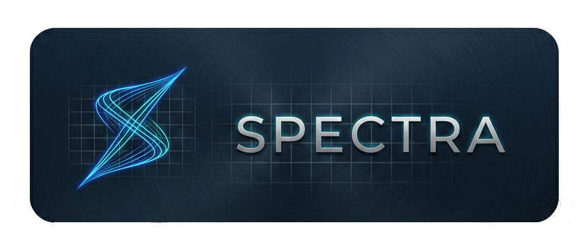

<p align="center">
  
</p>

<h3 align="center">GPU-accelerated scientific plotting for C++20 and Python</h3>

<p align="center">
  <a href="https://danlil240.github.io/Spectra/">Documentation</a> · <a href="https://danlil240.github.io/Spectra/getting-started.html">Quick Start</a> · <a href="https://danlil240.github.io/Spectra/examples.html">Examples</a> · <a href="https://danlil240.github.io/Spectra/ros2-adapter.html">ROS2 Adapter</a>
</p>

---

## Why Spectra?

Most plotting libraries are CPU-bound, single-threaded, and treat animation as an afterthought. Spectra is different:

- **GPU-first** — Vulkan 1.2 rendering. Anti-aliased lines, 18 SDF markers, and dash patterns run entirely on the GPU.
- **Real-time ready** — Stream live sensor data at 60 fps with O(1) ring-buffer appends and zero-copy NumPy transfers.
- **2D + 3D in one library** — Line, scatter, surface, mesh plots with Blinn-Phong lighting, colormaps, and orbit camera.
- **Feels like MATLAB** — `spectra::plot(x, y, "r--o")` one-liners that scale to multi-window, multi-tab workspaces.
- **C++ and Python** — Native C++20 library with a Python IPC bridge that auto-launches the backend.
- **Headless export** — Render to PNG, GIF, or MP4 without a window — perfect for CI and batch pipelines.

---

## 5-Second Demo

**C++:**
```cpp
#include <spectra/easy.hpp>

int main() {
    spectra::plot({0.f, 1.f, 2.f, 3.f, 4.f},
                  {0.f, 1.f, 0.5f, 1.5f, 2.f}, "c-o");
    spectra::title("Hello Spectra");
    spectra::show();
}
```

**Python:**
```python
import spectra as sp
sp.plot([0, 1, 4, 9, 16, 25])
sp.show()
```

---

## Install

```bash
git clone https://github.com/danlil240/Spectra.git
cd Spectra
cmake -B build -DCMAKE_BUILD_TYPE=Release
cmake --build build -j$(nproc)
```

```bash
# Python
pip install spectra-plot
```

> **Platform-specific setup, CMake options, Eigen integration, and packaging →** [Getting Started Guide](https://danlil240.github.io/Spectra/getting-started.html)

---

## Feature Highlights

| Domain | What you get |
|---|---|
| **Core Rendering** | Vulkan pipeline, MSAA 4x, GPU text, SDF anti-aliasing, format strings (`"r--o"`) |
| **3D Visualization** | Surface, mesh, scatter, line — with lighting, transparency, wireframe, colormaps |
| **Easy API** | `plot()`, `scatter()`, `subplot()`, `plot3()`, `surf()` — 7 levels of progressive complexity |
| **Animation** | Frame callbacks, timeline editor, 7 keyframe interpolation modes, camera animator |
| **UI** | Command palette, undo/redo, docking/split view, inspector, configurable shortcuts |
| **Data Interaction** | Tooltips, crosshair, markers, linked axes, shared cursor, 14 data transforms |
| **Multi-Window** | Independent OS windows, tab tear-off, per-window Vulkan swapchain |
| **Python** | `spectra.plot()` one-liners, NumPy fast path, live streaming, auto-launch backend |
| **Export** | Headless PNG/GIF/MP4, CMake `find_package`, plugin API, workspace save/load |
| **ROS2** | Topic monitor, live plotter, bag player/recorder, TF tree, node graph, service caller |

> **Full feature breakdown →** [Feature Guide](https://danlil240.github.io/Spectra/features.html)

---

## Python Quick Start

```python
import spectra as sp
import numpy as np

x = np.linspace(0, 10, 500)

sp.subplot(2, 1, 1)
sp.plot(x, np.sin(x), label="sin")
sp.title("Sine")

sp.subplot(2, 1, 2)
sp.plot(x, np.cos(x), label="cos")
sp.title("Cosine")

sp.show()
```

Live streaming, 3D plots, statistical charts, and the Session API are covered in the [documentation](https://danlil240.github.io/Spectra/features.html#python-api).

---

## ROS2 Adapter

Replace the entire `rqt` suite with one GPU-accelerated tool. Topic monitor, live plotter, bag player/recorder, TF tree, node graph, parameter editor, service caller — all in a single window.

```bash
source /opt/ros/humble/setup.bash
cmake -S . -B build-ros2 -DSPECTRA_USE_ROS2=ON -DCMAKE_BUILD_TYPE=Release
ninja -C build-ros2 spectra-ros
./build-ros2/spectra-ros --topics /imu/data.linear_acceleration.x
```

> **Full ROS2 documentation →** [ROS2 Adapter Guide](https://danlil240.github.io/Spectra/ros2-adapter.html)

---

## 40+ Examples

The `examples/` directory covers every major feature — from basic line plots to 3D lit surfaces, timeline animation, multi-window tabs, and headless export.

```bash
./build/examples/basic_line
./build/examples/demo_3d
./build/examples/easy_api_demo
```

> **Full example index →** [Examples](https://danlil240.github.io/Spectra/examples.html)

---

## Architecture

Spectra runs in two modes selected at runtime — no `#ifdef`:

- **Inproc** (default) — Single-process: App → WindowManager → Renderer → Vulkan
- **Multiproc** — Daemon (`spectra-backend`) + window agents via versioned TLV IPC protocol

All windows are peer-equivalent. No "primary window" concept. Stable `FigureId` ownership via `FigureRegistry`.

> **System topology, project structure, design decisions →** [Architecture Overview](https://danlil240.github.io/Spectra/architecture.html)

---

## Quality

- **1,200+ unit tests** · **50+ golden image tests** · **100+ benchmarks**
- Cross-platform CI: Linux (GCC + Clang), macOS (ARM), Windows (MSVC)
- ASan + UBSan sanitizer jobs · Headless golden tests via lavapipe
- Release pipeline: `.deb`, `.rpm`, AppImage, `.dmg`, `.zip`, Python wheels → PyPI

```bash
cmake -B build -DSPECTRA_BUILD_TESTS=ON
cmake --build build && cd build && ctest --output-on-failure
```

---

## Contributing

1. **C++20** — No global state, RAII, thread-safe via `std::mutex`
2. **Tests required** — Add unit tests; run `ctest` before submitting
3. **Vulkan safety** — Never destroy resources without waiting on fences
4. **No speculative fixes** — Measure first, then optimize

```bash
make build test    # Build + run tests
make format        # clang-format
```

---

## License

MIT License. See [LICENSE](LICENSE) for details.

---

<p align="center">
  <a href="https://danlil240.github.io/Spectra/">📖 Documentation</a> · <a href="https://danlil240.github.io/Spectra/getting-started.html">🚀 Getting Started</a> · <a href="https://danlil240.github.io/Spectra/features.html">✨ Features</a> · <a href="https://danlil240.github.io/Spectra/examples.html">📋 Examples</a>
</p>
