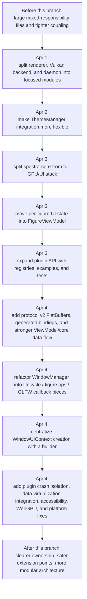

# Spectra Branch Walkthrough: What Changed in the Last 3 Days

> **Written on:** 2026-04-04
> **Period covered:** 2026-04-01 through 2026-04-04
> **Branch inspected:** `copilot/iterate-until-ci-passes`
> **Scope:** All non-merge commits in this window, including both your direct commits and bot-assisted commits

---

## What this document is

This is a plain-English walkthrough of what changed in the project over the last 3 days.

It is written for the case where you open the branch and ask:

- What actually changed?
- Why were these changes made?
- How do the changes connect to each other?
- Which files should I read first if I want to understand the new shape of the code?

This is **not** a commit dump.
It is a guided explanation of the branch as a whole.

### Quick facts

- Total non-merge commits in this window: `47`
- Your direct non-merge commits: `17`
- Bot-assisted non-merge commits: `30`
- Most of the activity happened on `2026-04-04`

---

## Big Picture First

If you ignore the day-by-day details, the branch did six big things:

1. It **broke large subsystems into smaller files** so the code is easier to understand and maintain.
2. It **cleaned up UI and window architecture**, especially around `WindowManager`, `WindowUIContext`, input handling, and callback wiring.
3. It **moved state closer to the objects that own it**, especially by expanding the ViewModel layer.
4. It **turned plugins into a more serious platform**, with registries, examples, tests, and fault isolation.
5. It **upgraded internal communication and data flow**, especially with FlatBuffers protocol v2, thread-safe series handling, and ViewModel-driven rendering/input.
6. It **expanded feature coverage**, including data virtualization, accessibility, WebGPU, Python logging, and many CI/platform fixes.

The overall direction of the branch is:

- less "one giant file does everything"
- more explicit boundaries
- more testable seams
- better support for large data, plugins, multi-process work, and alternate backends

---

## Quick Glossary

These names come up a lot in the branch, so it helps to define them early.

- `WindowUIContext`
  A per-window bundle of UI-related state and services. It is the thing that collects together what a window needs to function.

- `FigureViewModel`
  A UI-facing model for figure state. Instead of storing figure UI state in a generic global/per-window bucket, the state moves closer to the figure itself.

- `Plugin guard`
  A safety layer around plugin execution. Its job is to reduce the chance that plugin faults crash or destabilize the host app.

- `FlatBuffers protocol v2`
  A newer structured IPC format. It gives the project a more formal way to encode messages between processes/components than ad hoc or legacy-only formats.

- `Data virtualization`
  A way to work with very large datasets without eagerly loading everything into ordinary in-memory structures at once.

- `LT-5`, `LT-8`, `LT-11`
  Feature tracks that continued to land inside this branch:
  - `LT-5`: ViewModel and renderer/input migration work
  - `LT-8`: large-data virtualization
  - `LT-11`: accessibility support

---

## One-Page Diagram

---

## How the Branch Evolved, Day by Day

## April 1, 2026: Break Up Large Subsystems

### Main change

Commit:

- `2358a7c` - `refactor: split renderer, Vulkan backend, and daemon into focused modules`

### What changed

This was the first major architectural move in the window.
The goal was simple: take a few oversized files that were doing too many jobs and split them into focused modules.

The most important splits were:

- Renderer work moved out of one central file and into:
  - [`src/render/render_2d.cpp`](../src/render/render_2d.cpp)
  - [`src/render/render_3d.cpp`](../src/render/render_3d.cpp)
  - [`src/render/render_geometry.cpp`](../src/render/render_geometry.cpp)
  - [`src/render/render_upload.cpp`](../src/render/render_upload.cpp)

- Vulkan-specific work was broken up around:
  - [`src/render/vulkan/vk_backend.cpp`](../src/render/vulkan/vk_backend.cpp)
  - [`src/render/vulkan/vk_capture.cpp`](../src/render/vulkan/vk_capture.cpp)
  - [`src/render/vulkan/vk_frame.cpp`](../src/render/vulkan/vk_frame.cpp)
  - [`src/render/vulkan/vk_multi_window.cpp`](../src/render/vulkan/vk_multi_window.cpp)
  - [`src/render/vulkan/vk_texture.cpp`](../src/render/vulkan/vk_texture.cpp)

- Daemon logic was split into:
  - [`src/daemon/daemon_server.cpp`](../src/daemon/daemon_server.cpp)
  - [`src/daemon/agent_message_handler.cpp`](../src/daemon/agent_message_handler.cpp)
  - [`src/daemon/heartbeat_monitor.cpp`](../src/daemon/heartbeat_monitor.cpp)
  - [`src/daemon/python_message_handler.cpp`](../src/daemon/python_message_handler.cpp)

### Why it matters

Before this change, understanding rendering or daemon behavior meant holding too much unrelated logic in your head at once.
After this split:

- rendering stages are easier to find
- Vulkan-specific responsibilities are easier to isolate
- daemon responsibilities are easier to reason about
- future changes have better file boundaries

This commit did not try to "finish" architecture cleanup.
It created the first clean seams that later changes built on.

### The easy mental model

Think of this day as:

- first, shrink the giant rooms into smaller rooms
- later, decide what furniture belongs in each room

That "later" part happens on the following days.

---

## April 2, 2026: Make Theme Handling More Flexible

### Main change

Commit:

- `3a79dd9` - `Refactor ThemeManager integration for improved flexibility`

### What changed

This change touched a wide slice of the UI stack:

- app startup
- renderer code
- ImGui integration
- overlays
- region selection
- window management
- Qt/embed/agent paths

Key files included:

- [`src/ui/theme/theme.cpp`](../src/ui/theme/theme.cpp)
- [`src/ui/theme/theme.hpp`](../src/ui/theme/theme.hpp)
- [`src/ui/imgui/imgui_integration.cpp`](../src/ui/imgui/imgui_integration.cpp)
- [`src/ui/app/app_step.cpp`](../src/ui/app/app_step.cpp)
- [`src/ui/window/window_manager.cpp`](../src/ui/window/window_manager.cpp)
- [`src/render/renderer.cpp`](../src/render/renderer.cpp)

### What this means in plain language

The code was becoming less dependent on theme behavior being hidden in rigid global-style access patterns.

This did **not** solve all theming debt in one shot.
What it did do was make ThemeManager integration more flexible and prepare the code for the larger UI/window refactors that follow.

### Why it matters

Theme-related code sits in a surprising number of places:

- drawing
- overlays
- dialogs
- app startup
- window creation

If theme wiring is too rigid, every later attempt to split window/UI code gets harder.
So this was groundwork.

---

## April 3, 2026: Separate Core, Move UI State, Expand Plugins

April 3 was about making boundaries clearer.
Three changes matter most.

### 1. Split `spectra-core` from the full app stack

Commit:

- `60999ad` - `refactor: split spectra into spectra-core (headless) and spectra (full GPU stack)`

### What changed

This change adjusted the project so a headless/core layer could exist more cleanly beside the full UI/GPU app layer.

Important files:

- [`CMakeLists.txt`](../CMakeLists.txt)
- [`include/spectra/event_bus.hpp`](../include/spectra/event_bus.hpp)
- [`include/spectra/knob_manager.hpp`](../include/spectra/knob_manager.hpp)
- [`src/ui/overlay/knob_manager.hpp`](../src/ui/overlay/knob_manager.hpp)
- [`src/ui/figures/figure_registry.cpp`](../src/ui/figures/figure_registry.cpp)

### Why it matters

This is about dependency direction.
The core library should not need the whole rendering/UI stack just to exist.

That makes it easier to support:

- headless use
- testing
- cleaner layering
- future runtime variants

### 2. Move per-figure UI state into `FigureViewModel`

Commit:

- `c423f36` - `refactor: migrate per-figure UI state from WindowUIContext to FigureViewModel`

### What changed

This introduced:

- [`src/ui/viewmodel/figure_view_model.cpp`](../src/ui/viewmodel/figure_view_model.cpp)
- [`src/ui/viewmodel/figure_view_model.hpp`](../src/ui/viewmodel/figure_view_model.hpp)

And updated code around:

- [`src/ui/app/window_ui_context.hpp`](../src/ui/app/window_ui_context.hpp)
- [`src/ui/figures/figure_manager.cpp`](../src/ui/figures/figure_manager.cpp)
- [`src/ui/app/window_runtime.cpp`](../src/ui/app/window_runtime.cpp)
- [`src/ui/window/window_manager.cpp`](../src/ui/window/window_manager.cpp)

### What this means in plain language

Before this change, some figure-specific UI state lived in a more general per-window context.
That makes ownership fuzzy.

After this change, figure-specific UI state lives in a figure-focused ViewModel.
That is easier to reason about because the state now lives closer to the thing it describes.

### Why it matters

This is one of the branch's most important architecture improvements.

It moves the codebase toward:

- clearer ownership
- fewer "miscellaneous state bucket" structures
- better testability
- easier future ViewModel expansion

### 3. Expand the plugin API into a real extension platform

Commit:

- `c661ae5` - `feat: expand plugin API with overlays, export/data-source registries, custom series, and integration tests`

### What changed

This was a large plugin-focused expansion.
It added or expanded:

- overlay registry
- export registry
- data-source registry
- custom series support
- series type registry
- plugin documentation
- example plugins
- integration and compatibility tests

Key files:

- [`src/ui/workspace/plugin_api.cpp`](../src/ui/workspace/plugin_api.cpp)
- [`src/ui/workspace/plugin_api.hpp`](../src/ui/workspace/plugin_api.hpp)
- [`src/ui/overlay/overlay_registry.cpp`](../src/ui/overlay/overlay_registry.cpp)
- [`src/io/export_registry.cpp`](../src/io/export_registry.cpp)
- [`src/adapters/data_source_registry.cpp`](../src/adapters/data_source_registry.cpp)
- [`src/render/series_type_registry.cpp`](../src/render/series_type_registry.cpp)
- [`docs/plugin_developer_guide.md`](plugin_developer_guide.md)
- [`examples/plugins/`](../examples/plugins/)

### Why it matters

Before this change, plugins were more limited and less formalized.
After it, plugins had many more supported extension points and much stronger test coverage.

This is the day where plugins started to look less like a side capability and more like a supported architecture surface.

---

## April 4, 2026: The Branch Becomes a Full Architecture Push

April 4 is where the branch got much larger.
Most of the work landed here, and it happened in several parallel tracks.

To keep this readable, it is easier to explain April 4 by theme instead of pretending it was one linear story.

---

## April 4 Theme A: Windowing and UI Architecture Cleanup

### Step 1: Split input and window responsibilities

Commit:

- `b8c4d59` - `Refactor WindowManager and ThemeManager tests`

Despite the commit title, this was much bigger than tests.

It introduced:

- [`src/ui/input/input_annotate.cpp`](../src/ui/input/input_annotate.cpp)
- [`src/ui/input/input_measure.cpp`](../src/ui/input/input_measure.cpp)
- [`src/ui/input/input_pan_zoom.cpp`](../src/ui/input/input_pan_zoom.cpp)
- [`src/ui/input/input_select.cpp`](../src/ui/input/input_select.cpp)
- [`src/ui/window/window_figure_ops.cpp`](../src/ui/window/window_figure_ops.cpp)
- [`src/ui/window/window_lifecycle.cpp`](../src/ui/window/window_lifecycle.cpp)

And it reduced the size of older concentration points like:

- [`src/ui/input/input.cpp`](../src/ui/input/input.cpp)

### What this means

Large "everything input" and "everything window" files were being split into task-specific pieces.
This makes it much easier to answer questions like:

- where does pan/zoom live?
- where does annotation handling live?
- where does window creation and teardown live?
- where does figure move/detach/preview behavior live?

### Step 2: Extract GLFW callback glue

Commits:

- `34c9190` - `Refactor: Extract GLFW callbacks from WindowManager`
- `da7b730` - `Refactor: Extract GLFW callbacks from WindowManager`

Important note:
these two history entries represent the same conceptual refactor showing up twice in history.
For understanding the branch, treat them as one change.

Main file:

- [`src/ui/window/window_glfw_callbacks.cpp`](../src/ui/window/window_glfw_callbacks.cpp)

### Why it matters

GLFW callback wiring is noisy, platform-facing code.
It tends to clutter higher-level window orchestration if left in the same file.

Pulling it out makes `WindowManager` read more like orchestration and less like low-level callback glue.

### Step 3: Remove duplicate `WindowManager` implementation paths

Commits:

- `f8d482a` - remove duplicated `WindowManager` methods
- `7a0e20c` - remove remaining duplicated `WindowManager` methods
- `eab1584` - `Refactors WindowManager and updates architecture review`

Important files:

- [`src/ui/window/window_manager.cpp`](../src/ui/window/window_manager.cpp)
- [`tools/architecture_metrics.py`](../tools/architecture_metrics.py)
- [`ARCHITECTURE_REVIEW_V3.md`](ARCHITECTURE_REVIEW_V3.md)

### What this means

The project had duplicate `WindowManager` implementations lingering in the build path during refactor churn.
These commits removed that duplication and tightened the architecture story so the repo matched the intended design more honestly.

### Step 4: Centralize `WindowUIContext` setup

Commits:

- `a59047f` - `Refactor: Centralizes WindowUIContext setup`
- `2546042` - `Disables specific UI context references`

New files:

- [`src/ui/app/window_ui_context_builder.cpp`](../src/ui/app/window_ui_context_builder.cpp)
- [`src/ui/app/window_ui_context_builder.hpp`](../src/ui/app/window_ui_context_builder.hpp)
- [`plans/2026-04-04-window-ui-context-builder-design.md`](plans/2026-04-04-window-ui-context-builder-design.md)

Touched paths:

- [`src/ui/app/app_step.cpp`](../src/ui/app/app_step.cpp)
- [`src/ui/window/window_lifecycle.cpp`](../src/ui/window/window_lifecycle.cpp)
- [`src/ui/commands/shortcut_manager.cpp`](../src/ui/commands/shortcut_manager.cpp)

### What this means in plain language

`WindowUIContext` setup used to be spread across more than one startup path.
That is risky because the different paths drift over time.

The new builder centralizes shared setup so:

- windowed startup
- headless startup
- shared command/shortcut/timeline/plugin wiring

can be assembled more consistently.

This is one of the clearest architecture wins in the branch because it reduces duplicated setup logic and makes startup behavior easier to reason about.

### Step 5: Small follow-up polish

Commit:

- `5e3746b` - `Improves animation performance and initializes theme.`

This is a small cleanup compared with the larger changes above.
It fits the same pattern: make startup/UI behavior a little more correct and less accidental.

---

## April 4 Theme B: IPC, ViewModels, and Core Data Flow

### Main protocol and data-flow expansion

Commits:

- `d372429` - `feat(ipc,viewmodel,core): protocol v2 FlatBuffers, ViewModel layer, thread-safe series`
- `3613e05` - follow-up commit with the same theme

### What changed

This was a very large architectural addition.
It introduced or expanded:

- a FlatBuffers schema
- a FlatBuffers codec
- generated Python bindings
- session/runtime integration updates
- pending series data support
- thread-safe series support
- axes and series ViewModels

Key files:

- [`src/ipc/schemas/spectra_ipc.fbs`](../src/ipc/schemas/spectra_ipc.fbs)
- [`src/ipc/codec_fb.cpp`](../src/ipc/codec_fb.cpp)
- [`src/ipc/codec_fb.hpp`](../src/ipc/codec_fb.hpp)
- [`python/spectra/_codec_fb.py`](../python/spectra/_codec_fb.py)
- [`python/spectra/_fb_generated/spectra/ipc/fb/`](../python/spectra/_fb_generated/spectra/ipc/fb/)
- [`src/ui/viewmodel/axes_view_model.cpp`](../src/ui/viewmodel/axes_view_model.cpp)
- [`src/ui/viewmodel/series_view_model.cpp`](../src/ui/viewmodel/series_view_model.cpp)
- [`src/core/pending_series_data.hpp`](../src/core/pending_series_data.hpp)

### What this means in plain language

This is the branch moving from "loosely structured message/state movement" toward "more formal message/state movement."

It makes the cross-process and UI-facing data story stronger by:

- giving messages a more explicit schema
- giving Python and C++ a shared encoded format
- giving the UI more ViewModel-backed data structures
- making series handling safer in threaded contexts

### Why it matters

This is infrastructure.
Users do not see it directly, but many future features depend on it.

Without stronger internal message and state structure, the project gets harder to scale.
With it, the system becomes easier to reason about across boundaries.

### LT-5 work that builds on the ViewModel direction

Commits:

- `73ea27e` - LT-5 validation and plan expansion
- `1b05b95` - migrate Renderer and InputHandler to use ViewModels
- `4df8cc0` - local visual-limit storage in `AxesViewModel`

Key files:

- [`src/render/render_2d.cpp`](../src/render/render_2d.cpp)
- [`src/render/render_geometry.cpp`](../src/render/render_geometry.cpp)
- [`src/render/renderer.cpp`](../src/render/renderer.cpp)
- [`src/ui/input/input.cpp`](../src/ui/input/input.cpp)
- [`src/ui/viewmodel/axes_view_model.cpp`](../src/ui/viewmodel/axes_view_model.cpp)

### Why these matter

These commits take the ViewModel idea and start pushing real systems over to it.

That matters because it means the ViewModel layer is not just a passive structure sitting on the side.
Rendering and input begin to depend on it directly.

In other words:

- first, create ViewModels
- then, move real behavior to use them

That is exactly the kind of migration pattern you want in a large codebase.

---

## April 4 Theme C: Plugin Safety and Cross-Platform Hardening

### Plugin crash isolation

Commit:

- `a61eff4` - `feat: implement plugin guard for crash isolation and fault handling`

New files:

- [`src/ui/workspace/plugin_guard.cpp`](../src/ui/workspace/plugin_guard.cpp)
- [`src/ui/workspace/plugin_guard.hpp`](../src/ui/workspace/plugin_guard.hpp)

### What this means

After the plugin API became much more capable on April 3, the next logical question was:

What happens when a plugin misbehaves?

The plugin guard is the answer.
It is a defensive layer meant to reduce how much damage plugin faults can cause.

This is important because the more powerful the extension system becomes, the more the host app needs protection around it.

### Platform and CI fixes around plugin/build behavior

Commits:

- `7fd13e5` - Windows plugin `dllexport`, file locking in tests, platform-conditional plugin linking
- `14300bf` - comment warning cleanup and macOS/ASan plugin test fixes
- `3827765` - improve UBSan detection
- `5203254` - suppress FlatBuffers library warning
- `eb5400a` - fix CI failures around warnings and plugin version checks
- `de5b565` - merge build command comments into one line

### What this means in plain language

Once the branch introduced bigger plugin and architecture changes, the build/test matrix started surfacing edge cases.
These commits are the "make the new architecture survive real toolchains and platforms" part of the story.

They matter because they turn "works on my machine" into "has a better chance of working across Linux/macOS/Windows and sanitizers."

---

## April 4 Theme D: Large-Data Support and Virtualization

### Main data-virtualization feature

Commits:

- `0471222` - `feat: implement LT-8 data virtualization with ChunkedArray, MappedFile, LodCache, and ChunkedLineSeries`
- `c836659` - follow-up fixes after review
- `9d6c16a` - adapt `ChunkedLineSeries` after merge conflict with non-movable base class
- `0f6c9d0` - small refactor in PX4 app shell
- `efc91fb` - integrate `ChunkedLineSeries` into Axes, ROS2, and PX4 adapters

Key files:

- [`include/spectra/chunked_series.hpp`](../include/spectra/chunked_series.hpp)
- [`src/core/chunked_series.cpp`](../src/core/chunked_series.cpp)
- [`src/data/chunked_array.hpp`](../src/data/chunked_array.hpp)
- [`src/data/lod_cache.hpp`](../src/data/lod_cache.hpp)
- [`src/data/mapped_file.cpp`](../src/data/mapped_file.cpp)
- [`src/adapters/ros2/ros_plot_manager.cpp`](../src/adapters/ros2/ros_plot_manager.cpp)
- [`src/adapters/px4/px4_app_shell.cpp`](../src/adapters/px4/px4_app_shell.cpp)

### What this means in plain language

This is the branch's answer to heavy data.

Instead of assuming all data should behave like a small, simple in-memory series, the branch added infrastructure for:

- chunked storage
- mapped file access
- level-of-detail caching
- chunk-aware series rendering

### Why it matters

This is a scale story.
It helps the project work better when datasets are too large for naive handling.

The follow-up adapter work matters because it takes the feature out of isolation and connects it to real application paths like ROS2 and PX4.

---

## April 4 Theme E: Accessibility Improvements

### Main change

Commit:

- `3eccc50` - `feat: LT-11 accessibility — keyboard navigation, HTML table export, and sonification`

New files:

- [`src/ui/accessibility/sonification.cpp`](../src/ui/accessibility/sonification.cpp)
- [`src/ui/accessibility/sonification.hpp`](../src/ui/accessibility/sonification.hpp)
- [`src/ui/data/html_table_export.cpp`](../src/ui/data/html_table_export.cpp)
- [`src/ui/data/html_table_export.hpp`](../src/ui/data/html_table_export.hpp)

Touched files:

- [`src/ui/app/register_commands.cpp`](../src/ui/app/register_commands.cpp)
- [`src/ui/commands/shortcut_manager.cpp`](../src/ui/commands/shortcut_manager.cpp)

### What this means

Accessibility became a first-class feature area in this window.
This work added:

- keyboard navigation improvements
- HTML table export
- sonification support

### Why it matters

This branch was not only about architecture cleanup.
It also expanded what kinds of users and workflows the app can support.

Accessibility work is especially important because it often requires touching command registration, shortcuts, and data presentation in coordinated ways.

---

## April 4 Theme F: WebGPU and WebAssembly Support

### Main backend addition

Commits:

- `55f3ac1` - `feat: add WebGPU/WebAssembly backend with WGSL shaders`
- `359687a` - whitespace cleanup

Key files:

- [`src/render/webgpu/wgpu_backend.cpp`](../src/render/webgpu/wgpu_backend.cpp)
- [`src/render/webgpu/wgpu_backend.hpp`](../src/render/webgpu/wgpu_backend.hpp)
- [`src/gpu/shaders/wgsl/grid.wgsl`](../src/gpu/shaders/wgsl/grid.wgsl)
- [`src/gpu/shaders/wgsl/line.wgsl`](../src/gpu/shaders/wgsl/line.wgsl)
- [`src/gpu/shaders/wgsl/scatter.wgsl`](../src/gpu/shaders/wgsl/scatter.wgsl)
- [`src/gpu/shaders/wgsl/stat_fill.wgsl`](../src/gpu/shaders/wgsl/stat_fill.wgsl)
- [`src/gpu/shaders/wgsl/text.wgsl`](../src/gpu/shaders/wgsl/text.wgsl)

### Demo/example follow-up

Commits:

- `9362140` - add WebGPU usage example with Emscripten HTML shell
- `e0487fb` - address review feedback in the example

Files:

- [`examples/webgpu_demo.cpp`](../examples/webgpu_demo.cpp)
- [`examples/webgpu_shell.html`](../examples/webgpu_shell.html)

### What this means in plain language

The project gained a real experimental WebGPU/WebAssembly path.

This does **not** mean the WebGPU backend is at full parity with the Vulkan path.
But it does mean the codebase now has:

- backend implementation
- WGSL shader assets
- tests
- a runnable example path

That makes WebGPU a concrete part of the repo rather than a vague future idea.

---

## April 4 Theme G: Logging and Readability

### Python/client logging

Commit:

- `b08ac0b` - `Adds comprehensive client-side logging`

Key files:

- [`python/spectra/_log.py`](../python/spectra/_log.py)
- [`python/spectra/_launcher.py`](../python/spectra/_launcher.py)
- [`python/spectra/_transport.py`](../python/spectra/_transport.py)

### What this means

The Python/client side got better visibility into what is happening.
That is useful for debugging runtime and transport issues, especially in a project that is increasingly multi-process and protocol-driven.

### Readability and consistency cleanup

Commit:

- `f38f796` - `Refactor code for improved readability and consistency`

### Why it matters

This is the sort of supporting cleanup that keeps a large branch from becoming impossible to maintain.
It did not introduce one new subsystem by itself, but it reduced friction across many files.

---

## The Branch Story in One Sentence

The branch started by breaking large systems into smaller modules, then cleaned up ownership and architecture around UI, plugins, and data flow, and finally expanded the project's capabilities with safer plugins, stronger IPC, large-data support, accessibility, WebGPU, and better cross-platform reliability.

---

## Before vs After

### Before

The repo had more places where responsibilities were mixed together:

- rendering logic concentrated in fewer, larger files
- Vulkan backend work mixed into broader backend code
- daemon responsibilities concentrated in `main.cpp`
- `WindowManager` carrying too many kinds of behavior
- `WindowUIContext` setup spread across paths
- figure UI state not yet clearly owned by `FigureViewModel`
- plugin architecture expanding, but not yet as formalized or protected

### After

The repo has more explicit seams:

- rendering is split by concern
- Vulkan helper areas are separated
- daemon responsibilities are named and isolated
- input/window behavior is split into focused modules
- GLFW callback glue is separated from higher-level window logic
- `WindowUIContext` assembly has a builder
- `FigureViewModel`, `AxesViewModel`, and `SeriesViewModel` matter more
- plugin extension points are broader and plugin safety is stronger
- IPC format and Python bindings are more structured
- large-data handling has a clearer architecture path

---

## If You Want to Read the Code, Start Here

If you want to understand the branch by reading code instead of commit history, this is a good reading order.

### 1. Window/UI architecture

- [`src/ui/window/window_lifecycle.cpp`](../src/ui/window/window_lifecycle.cpp)
- [`src/ui/window/window_figure_ops.cpp`](../src/ui/window/window_figure_ops.cpp)
- [`src/ui/window/window_glfw_callbacks.cpp`](../src/ui/window/window_glfw_callbacks.cpp)
- [`src/ui/app/window_ui_context_builder.cpp`](../src/ui/app/window_ui_context_builder.cpp)
- [`src/ui/app/app_step.cpp`](../src/ui/app/app_step.cpp)

### 2. ViewModel and IPC architecture

- [`src/ui/viewmodel/figure_view_model.cpp`](../src/ui/viewmodel/figure_view_model.cpp)
- [`src/ui/viewmodel/axes_view_model.cpp`](../src/ui/viewmodel/axes_view_model.cpp)
- [`src/ui/viewmodel/series_view_model.cpp`](../src/ui/viewmodel/series_view_model.cpp)
- [`src/ipc/codec_fb.cpp`](../src/ipc/codec_fb.cpp)
- [`src/ipc/schemas/spectra_ipc.fbs`](../src/ipc/schemas/spectra_ipc.fbs)

### 3. Plugin architecture

- [`src/ui/workspace/plugin_api.cpp`](../src/ui/workspace/plugin_api.cpp)
- [`src/ui/workspace/plugin_guard.cpp`](../src/ui/workspace/plugin_guard.cpp)
- [`docs/plugin_developer_guide.md`](plugin_developer_guide.md)

### 4. Rendering/backend modularization

- [`src/render/render_2d.cpp`](../src/render/render_2d.cpp)
- [`src/render/render_geometry.cpp`](../src/render/render_geometry.cpp)
- [`src/render/vulkan/vk_backend.cpp`](../src/render/vulkan/vk_backend.cpp)
- [`src/render/webgpu/wgpu_backend.cpp`](../src/render/webgpu/wgpu_backend.cpp)

### 5. Large-data path

- [`src/data/chunked_array.hpp`](../src/data/chunked_array.hpp)
- [`src/data/lod_cache.hpp`](../src/data/lod_cache.hpp)
- [`src/data/mapped_file.cpp`](../src/data/mapped_file.cpp)
- [`src/core/chunked_series.cpp`](../src/core/chunked_series.cpp)

### 6. Best tests to read

- [`tests/unit/test_window_ui_context_builder.cpp`](../tests/unit/test_window_ui_context_builder.cpp)
- [`tests/unit/test_figure_view_model.cpp`](../tests/unit/test_figure_view_model.cpp)
- [`tests/unit/test_ipc_flatbuffers.cpp`](../tests/unit/test_ipc_flatbuffers.cpp)
- [`tests/unit/test_series_view_model.cpp`](../tests/unit/test_series_view_model.cpp)
- [`tests/unit/test_plugin_guard.cpp`](../tests/unit/test_plugin_guard.cpp)
- [`tests/unit/test_accessibility.cpp`](../tests/unit/test_accessibility.cpp)
- [`tests/unit/test_webgpu_backend.cpp`](../tests/unit/test_webgpu_backend.cpp)
- [`tests/unit/test_chunked_series.cpp`](../tests/unit/test_chunked_series.cpp)

---

## Final Summary

If you are seeing this branch for the first time, the most important thing to understand is that it is **not** one feature.
It is a concentrated architecture-and-capability branch.

The branch does all of the following at once:

- refactors oversized systems into focused modules
- improves ownership of UI-facing state
- expands plugin power and plugin safety
- formalizes IPC and ViewModel data flow
- adds support for larger datasets
- improves accessibility
- introduces an experimental WebGPU path
- hardens the build against platform and CI issues

So the right way to read it is not "what one feature was added?"
The right way to read it is:

"This branch makes the codebase more modular, safer, and easier to grow, while also landing several new capability tracks on top of that cleanup."

That is the real story of the last 3 days.
