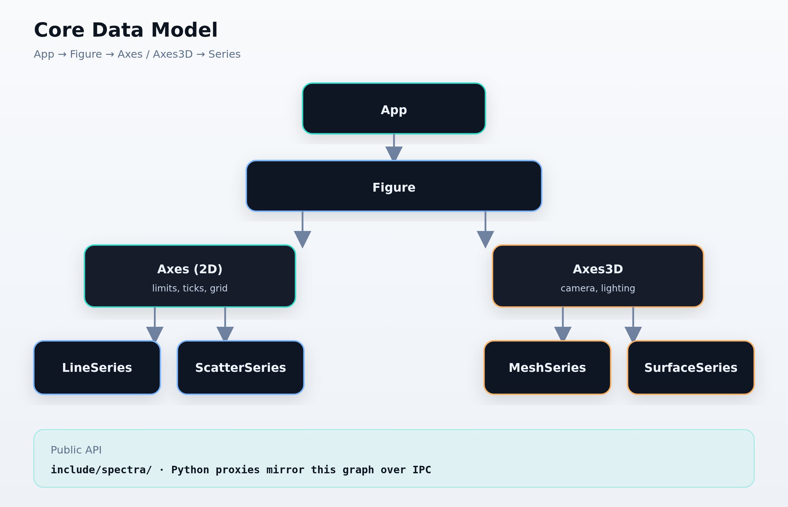
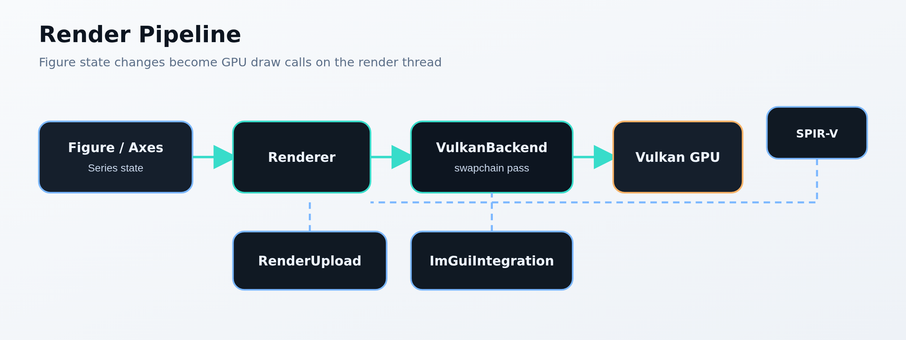
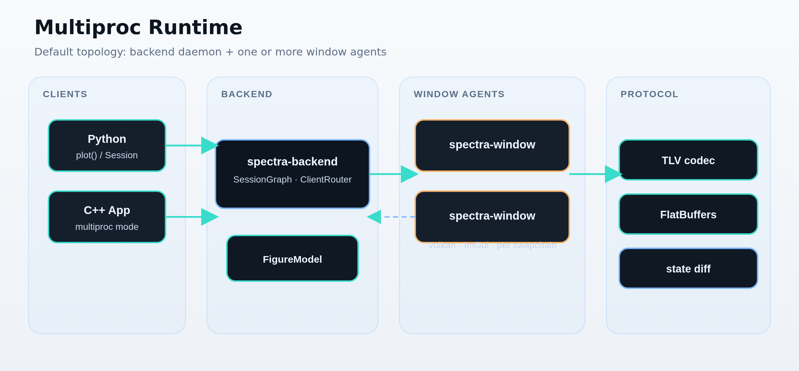
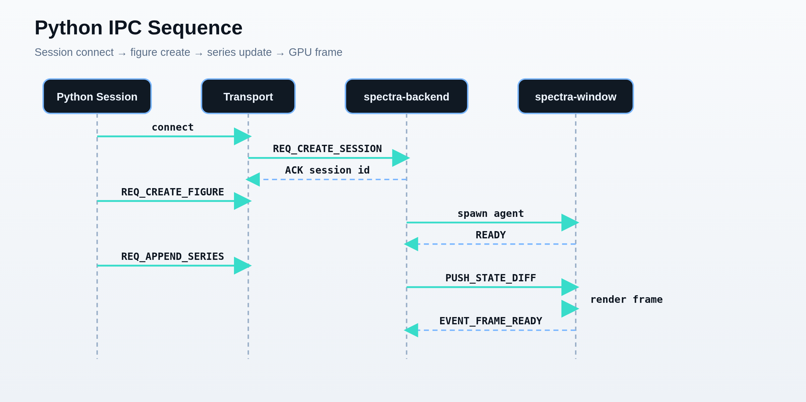

# Spectra Architecture (graphify bridge)

This document names the **cross-module contracts** graphify should link. It is written for humans and for semantic extraction — explicit symbol names create `conceptually_related_to` and `rationale_for` edges between communities.

> **Visual maps:** Full-size diagrams in [`diagrams.html`](diagrams.html).

## Core data model (C++)

Hierarchy: **App → Figure → Axes / Axes3D → Series**.

| Symbol | Location | Role |
|--------|----------|------|
| `App` | `src/app/` | Top-level owner; holds managers (no globals). |
| `Figure` | `src/core/figure.*` | Plot container; title, legend, axes list. |
| `Axes` | `src/core/axes.*` | 2D plot area; limits, ticks, series children. |
| `Axes3D` | `src/core/axes3d/` | 3D plot area; camera, grid, 3D series. |
| `Series` | `src/core/series.*` | Line, scatter, bar, heatmap, etc. |
| `Series3D` | `src/core/series3d.*` | Mesh, surface, point cloud. |

Public headers live in `include/spectra/` only. Implementation in `src/core/`.

## Render pipeline

| Symbol | Location | Role |
|--------|----------|------|
| `Backend` | `include/spectra/backend.hpp` | Strategy interface for GPU backends. |
| `VulkanBackend` | `src/render/vulkan/vk_backend.*` | Production renderer (Vulkan 1.2+). |
| `WebGPUBackend` | `src/render/webgpu/wgpu_backend.*` | Experimental 2D WebGPU backend. |
| `Renderer` | `src/render/renderer.*` | Queues draw commands; uses active `Backend`. |
| `RenderUpload` | `src/render/render_upload.*` | CPU→GPU upload path for series data. |

**Flow:** `Figure` state changes → `Renderer` builds draw list → `VulkanBackend` records Vulkan commands → shaders in `src/gpu/shaders/` (SPIR-V via CMake).

`ImGuiIntegration` holds a pointer to `Backend` for UI overlay rendering and shares the swapchain/render pass with the plot canvas.

## UI layer

| Symbol | Location | Role |
|--------|----------|------|
| `ImGuiIntegration` | `src/ui/imgui/imgui_integration.*` | Main ImGui frame: menubar, canvas, panels, docking. |
| `WindowManager` | `src/ui/window/window_manager.*` | GLFW/SDL window lifecycle, swapchain resize. |
| `InputHandler` | `src/ui/input/input_handler.*` | Mouse/keyboard routing to axes and UI. |
| `SessionRuntime` | `src/ui/app/session_runtime.*` | Multiproc session loop; owns window set. |
| `WindowRuntime` | `src/ui/app/window_runtime.*` | Per-window tick: input → UI → render. |
| `WindowUIContextBuilder` | `src/ui/app/window_ui_context_builder.*` | Wires `ImGuiIntegration`, `WindowManager`, `InputHandler`. |
| `FigureManager` | `src/ui/figures/figure_manager.*` | Figure tabs, active figure, registry. |
| `CommandRegistry` | `src/ui/commands/` | Palette commands and keyboard shortcuts. |

**Flow:** `WindowRuntime::update()` → `ImGuiIntegration::build_ui()` → user edits `Figure`/`Axes`/`Series` → render thread draws via `VulkanBackend`.

## IPC and multiprocess runtime

Spectra runs as **inproc** (single `build/spectra`) or **multiproc** (default):

| Binary | Role |
|--------|------|
| `spectra-backend` | `src/daemon/` — owns session graph, routes IPC. |
| `spectra-window` | `src/agent/` — window process; Vulkan + ImGui. |
| Python client | `python/spectra/` — `plot()`, `show()`, session API. |

| Symbol | Location | Role |
|--------|----------|------|
| `PayloadEncoder` | `src/ipc/codec.*` | C++ side: Python/app → backend messages. |
| `PayloadDecoder` | `src/ipc/codec.*` | C++ side: decode incoming payloads. |
| `PayloadEncoder` (Python) | `python/spectra/_codec.py` | Must stay in sync with C++ codec. |
| `PayloadDecoder` (Python) | `python/spectra/_codec.py` | Mirror of C++ decode. |
| `Session` | `python/spectra/_session.py` | Python session handle; transport connect. |
| `Transport` | `python/spectra/_transport.py` | Socket/pipe to `spectra-backend`. |
| FlatBuffers | `src/ipc/schemas/` | Binary schema for high-throughput messages. |

**Cross-language contract:** `tests/unit/test_cross_codec.cpp` and `python/tests/test_codec.py` verify C++ ↔ Python parity. Any IPC change must update both codecs and cross-codec tests.

**Rationale:** Static AST cannot link Python references to C++ `PayloadEncoder` — this document and tests define that bridge.

## Python bindings

| Module | Role |
|--------|------|
| `python/spectra/_easy.py` | MATLAB-style `plot()` API. |
| `python/spectra/_figure.py`, `_axes.py`, `_series.py` | Proxies mirroring C++ hierarchy. |
| `python/spectra/_launcher.py` | Starts backend/window when using `show()`. |

Python **Figure** proxies talk to C++ **Figure** via IPC, not in-process calls (multiproc mode).

## Plugins and workspace

| Symbol | Location | Role |
|--------|----------|------|
| Workspace v3 | `src/ui/workspace/` | Plugin manifests for series, sources, overlays, transforms. |
| Example plugins | `examples/plugins/` | Reference series/overlay/transform plugins. |

Plugins extend **Series** types and UI overlays without modifying core.

## ROS2 and PX4 adapters

| Symbol | Location | Role |
|--------|----------|------|
| `RosAppShell` | `src/adapters/ros2/ui/` | ROS-aware app shell and panels. |
| ROS message adapters | `src/adapters/ros2/messages/` | Topic → **Series** data path. |
| PX4 / ULog | `src/adapters/px4/` | Flight-log replay and telemetry plots. |

## Automation / MCP

| Symbol | Location | Role |
|--------|----------|------|
| MCP server | `src/ui/automation/` | HTTP MCP for smoke tests, screenshots, plot setup. |

MCP drives a live **Figure** through the same command path as the UI **CommandRegistry**.

## God-node dependency sketch

See the full-size diagrams in [`architecture.html`](architecture.html#visual-overview) and [`diagrams.html`](diagrams.html): data model hierarchy, render pipeline, inproc vs multiproc topology, and Python IPC sequence.

When tracing paths in graphify, prefer **file-qualified labels** (e.g. `vk_backend.hpp VulkanBackend`) because symbol names repeat across reference nodes.
